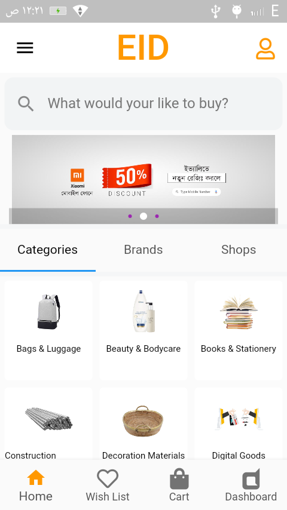
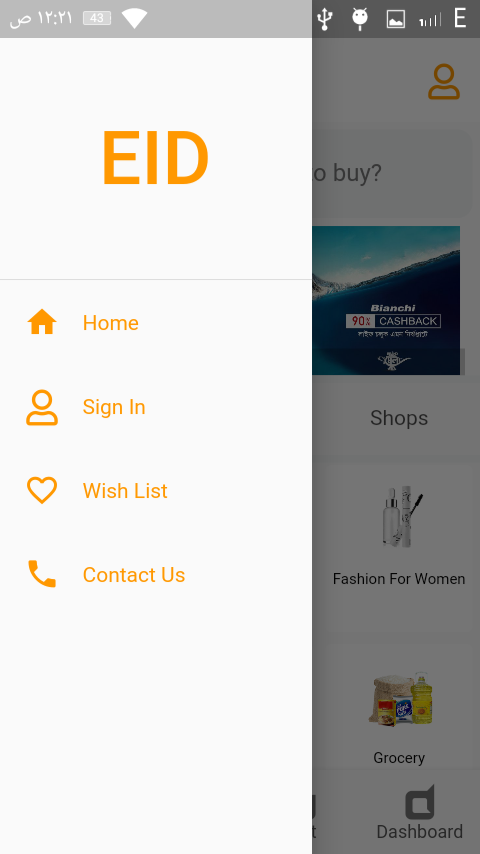
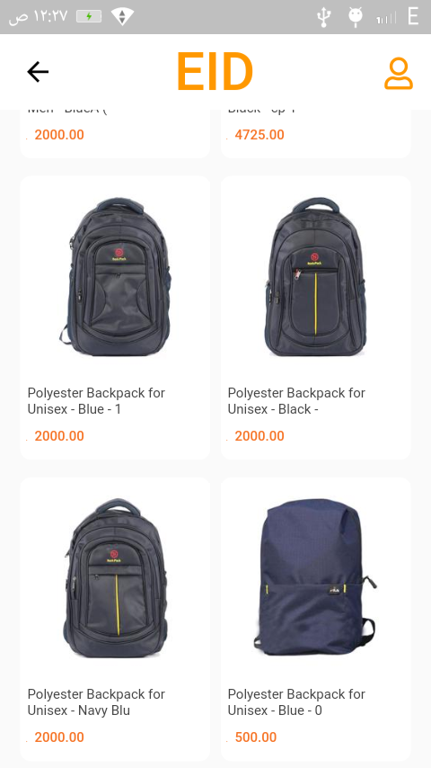
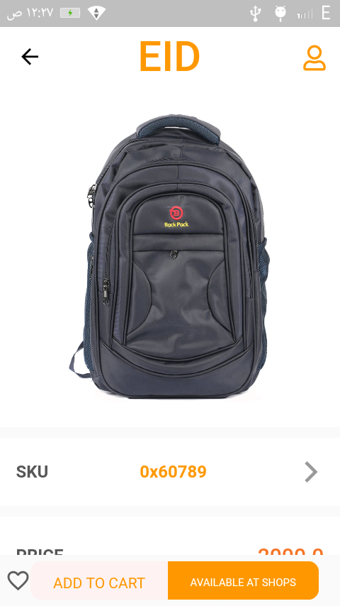
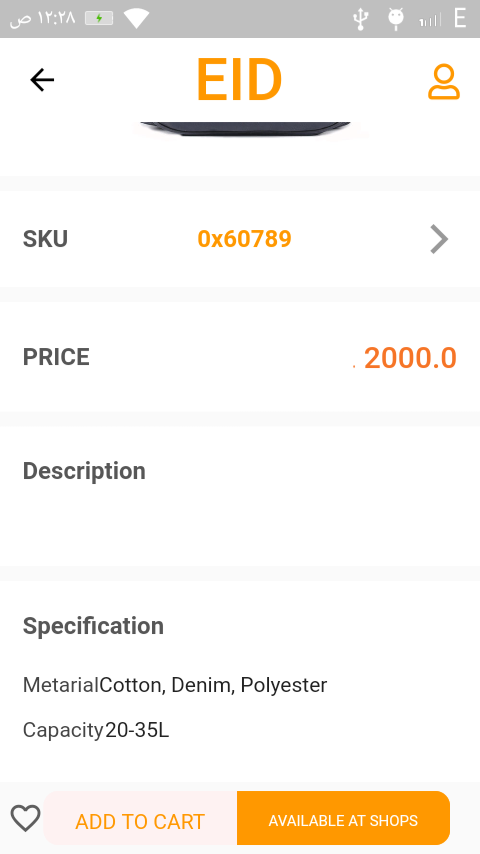
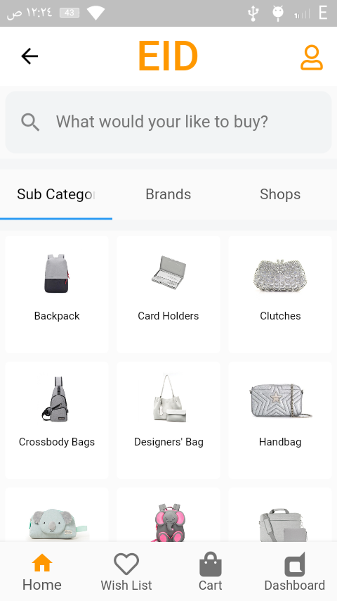

# shop_lovers_app

It's a ecommerce flutter application A small attempt to make an e-commerce user interface in Flutter for Android and iOS. 
I got all API from online by inspecting the orginal website. .

## some vidoes
<!-- record_1 -->

<!-- record_2 -->

## Screenshots

   
 
    

    

   